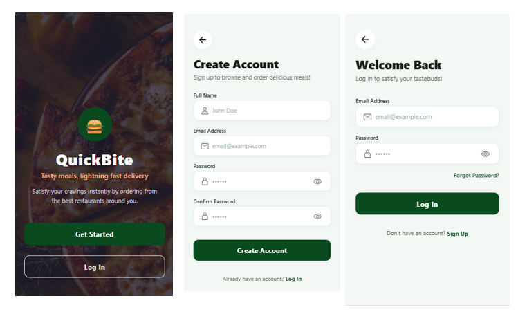
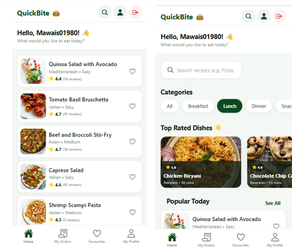
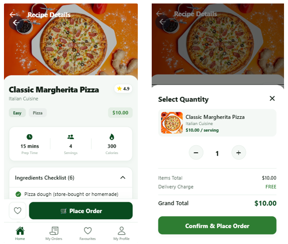

# QuickBite 🍔 — Premium Food Delivery Application

QuickBite is a luxurious, high-performance, cross-platform food delivery and recipe browsing application built using **React Native**, **Expo SDK 54**, and **Firebase (Authentication & Cloud Firestore)**. Designed with a custom-themed visual design system named **"Gourmet Emerald"**, the app offers a responsive and seamless user experience on both Mobile (iOS/Android) and Web environments.

---

## 📸 App Showcase & Interfaces

Here is a visual breakdown of the gorgeous user interfaces designed for QuickBite:

### 1. Onboarding & Authentication Flow
A premium welcome screen with a high-resolution dark organic forest overlay leading into modern, secure authentication screens.


### 2. Gourmet Dashboard & Food Library
A personalized homepage highlighting chef-recommended items, categorised sliding filters, live recipe searches, and active status indicators.


### 3. Detail Specifications & Instant Ordering Sheet
Granular ingredient checklists, nutrition statistics, prep times, dynamic quantity calculations, and an integrated bottom sheet order confirmation system.


---

## ✨ Features & Architecture

### 🔑 1. Secure Authentication System 
*   **Platform-Aware Authentication**: Handled seamlessly through a single, unified `AuthContext` provider.
*   **Sign-Up Flow**: Registers new users in Firebase Authentication, creating a custom user profile with their designated display name.
*   **Login Flow**: Validates email credentials instantly and transitions route stacks safely.
*   **Robust Navigation Locks**: Guests are locked out of the app core using strict conditional stack navigation based on the user's active session state.

### 📦 2. Firebase Cloud Firestore Order Management
*   **Interactive Orders Tab**: Users can monitor their placed orders in real-time.
*   **Local Sorting Engine**: Solves standard Firestore missing-index crashes on client machines. Fetched orders are sorted dynamically **in-memory** by date, ensuring immediate loading.
*   **Detailed Order Metadata**: Each order records the recipe name, quantity, cuisine, total bill amount, timestamp, and dish image.

### 💾 3. AsyncStorage Favourites System 
*   **Offline Hearting**: Users can add or remove recipes to/from their local favourites library.
*   **State Persistence**: Selected meals are cached in device storage using `@react-native-async-storage/async-storage` and remain intact even after the app is closed or restarted.

### 🌐 4. DummyJSON API Integration & Resilient Fallback Engine 
*   **Live Recipe Queries**: Fetches fresh recipe data directly from the public `https://dummyjson.com/recipes` endpoint.
*   **Zero-Network Resiliency**: If the device experiences connection drops, firewall blocks, or `net::ERR_CONNECTION_RESET` errors, the system seamlessly activates a built-in **Local Gourmet Fallback Database** containing detailed pre-formatted meals, preventing app crashes.

### 🎨 5. Gourmet Emerald Design System
*   **Cohesive Theme**: Features a custom visual layout matching luxury organic branding.
*   **Custom success confirmation popup modal** with live billing calculations instead of browser default popups.
*   **Micro-interactions**: Hover effects, customized loading spinners, and custom buttons.

---

## 🛠️ Technology Stack

*   **Framework**: Expo (SDK 54) & React Native (0.81.5)
*   **Language**: TypeScript (Strict Typings)
*   **Database & Auth**: Firebase JS SDK v10.12.0
*   **Local Caching**: AsyncStorage
*   **Navigation**: React Navigation (Stack Navigation + Bottom Tabs Navigation)
*   **Styling**: StyleSheet API (Vanilla CSS flex layouts)

---

## 📂 Project Structure

```text
quickbite/
├── assets/                 # App icons, splash screens, and layout screenshots
│   └── screenshots/        # Onboarding, Dashboard, and Order Sheet images
├── src/
│   ├── components/         # Reusable UI widgets (CustomButtons, OrderCards, Chips)
│   ├── config/             # Firebase SDK initializer and configuration keys
│   ├── context/            # AuthContext provider containing session logic
│   ├── navigation/         # Navigators (AuthStack, MainTabNavigator, RootNavigator)
│   ├── screens/            # Application views
│   │   ├── auth/           # Onboarding, Login, and Registration Screens
│   │   └── main/           # Dashboard, FoodList, FoodDetail, Orders, Profile
│   ├── services/           # Live REST API integrations and local fallback database
│   └── theme/              # Central Gourmet Emerald Design System (Colors, Shadows, Typography)
├── App.tsx                 # Core App mounting point wrapping context providers
├── app.json                # Expo project settings
├── index.ts                # App startup entry point
└── package.json            # Scripts and NPM dependency registry
```

---

## 🚀 Setup & Installation Guide

### Prerequisites
Make sure you have Node.js (v18+) installed on your machine.

### 1. Clone & Install Dependencies
Navigate to the root project folder in your terminal and install all required modules:
```bash
npm install
```

### 2. Configure Firebase Environment
The app is pre-configured with a default Firebase Web project. If you wish to use your own Firebase database:
1. Create a new Firebase project at [Firebase Console](https://console.firebase.google.com/).
2. Enable **Email/Password Provider** in Authentication.
3. Create a **Cloud Firestore Database** (Start in Test Mode).
4. Update `src/config/firebase.ts` with your custom configuration keys:
```typescript
const firebaseConfig = {
  apiKey: "YOUR_API_KEY",
  authDomain: "YOUR_AUTH_DOMAIN",
  projectId: "YOUR_PROJECT_ID",
  storageBucket: "YOUR_STORAGE_BUCKET",
  messagingSenderId: "YOUR_MESSAGING_SENDER_ID",
  appId: "YOUR_APP_ID"
};
```

### 3. Running the Application

You can launch the development server on various platforms:

#### Run on Web browser
```bash
npm run web
```

#### Run on Android Device / Emulator
```bash
npm run android
```

#### Run on iOS Simulator
```bash
npm run ios
```

#### Expo Start Menu
```bash
npm run start
```

---

## 📐 Database & Color Tokens

### Firestore Collection Schema
Orders placed by users are saved in the `orders` collection:
```json
{
  "userId": "firebase-auth-uid-string",
  "recipeId": 1,
  "recipeName": "Classic Margherita Pizza",
  "quantity": 2,
  "totalPrice": 20.00,
  "status": "Processing",
  "orderTime": "Timestamp Object",
  "image": "https://images.unsplash.com/photo-1604382354936-07c5d9983bd3...",
  "cuisine": "Italian"
}
```

### Gourmet Emerald Color Palette
Located at `src/theme/index.ts`:
*   `primary`: `#094B1F` (Luxury Gourmet Emerald Green)
*   `accent`: `#FFB800` (Review Stars & Gold Highlights)
*   `dark`: `#111E15` (Deep Forest Green-Black Text)
*   `background`: `#F4F8F5` (Gentle Sage Cream Background)
*   `surface`: `#FFFFFF` (Clean, Pure White Cards)
*   `success`: `#2E7D32` (Rich Forest Success State)
*   `error`: `#D32F2F` (Gourmet Berry-Red Alerts)
